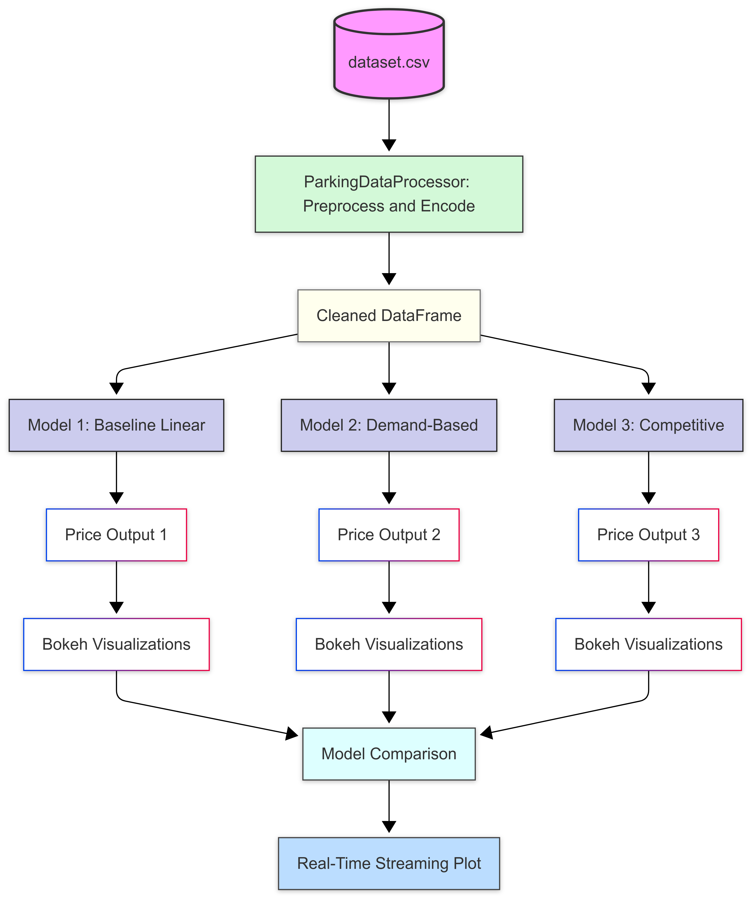

# 🚗 Dynamic Pricing for Urban Parking Lots
*Capstone Project for Summer Analytics 2025 – by Nishtha Jain*
---

## 📌 Project Overview

Urban parking spaces are scarce and often inefficiently priced. Fixed pricing leads to congestion during peak times and underutilization during off-peak hours. This project builds a **real-time dynamic pricing engine** using data from 14 parking lots over 73 days.

We implement **three increasingly intelligent pricing models** inside a single notebook and visualize the results using live interactive graphs.

---

## 🔧 Tech Stack

- **Python**
- **Pandas**, **NumPy**
- **Pathway** (for streaming simulation)
- **Bokeh** (for real-time plots)
- **Google Colab**

---

## 🧠 Pricing Models (All implemented in `final_colab.ipynb`)

### ✅ Model 1: Baseline Linear Model
Adjusts price linearly based on occupancy:  
$\text{Price}_{t+1} = \text{Price}_t + \alpha \cdot \left(\frac{\text{Occupancy}}{\text{Capacity}}\right)$

### ✅ Model 2: Demand-Based Model
Uses a custom **demand function** combining:
- Occupancy rate
- Queue length
- Traffic congestion
- Vehicle type
- Special event day

Demand is normalized and used to scale price from base.

### ✅ Model 3: Competitive Pricing (Optional Advanced)
Adds spatial intelligence using location (lat/long) and competitor pricing:
- Computes proximity to nearby lots
- Adjusts price based on nearby price trends
- Can reroute vehicles or surge price smartly

---

## 🛠️ Architecture

---

## 📊 Visualizations

Built using **Bokeh** in real time:
- Live price chart per lot
- Price comparison across models
- Optional: Price vs Competitor

---

## 🚀 How to Run

1. **Open the notebook**:  
   [`final_colab.ipynb`](final_colab.ipynb)

2. **Upload the dataset** to `dataset.csv`

3. **Run all cells** step by step:
   - Data loading and streaming
   - Model selection (Model 1 → Model 2 → Model 3)
   - Bokeh dashboard for visualizations

---

## 📝 Assumptions Made
- All models start from a base price of `$10`
- Prices are bounded: `min = $5`, `max = $20`
- Vehicle types are weighted as: car > truck > bike (in demand model)
- Location comparisons assume distances < 0.5 km are “nearby”

---

## 📄 Report (Optional)
If attached, the report is available at: [`report.md`](report.md)

---
## 🔍 Model Comparison Snapshot

| Model                | Features Used                                       | Smartness Level | Adaptivity |
|---------------------|-----------------------------------------------------|------------------|------------|
| Baseline Linear     | Occupancy                                           | ⭐               | 🔁 Medium   |
| Demand-Based        | Occupancy + Queue + Traffic + Special Day + Type   | ⭐⭐⭐            | 🔁 High    |
| Competitive Pricing | Demand Factors + Nearby Prices (Spatial Awareness) | ⭐⭐⭐⭐           | 🔁 Very High |

---

## 📬 Contact
For any questions, reach out via GitHub or email me at [ nishtha.jain5400@gmail.com ]

---

⭐ *If this helped you, consider giving the repo a ⭐*
